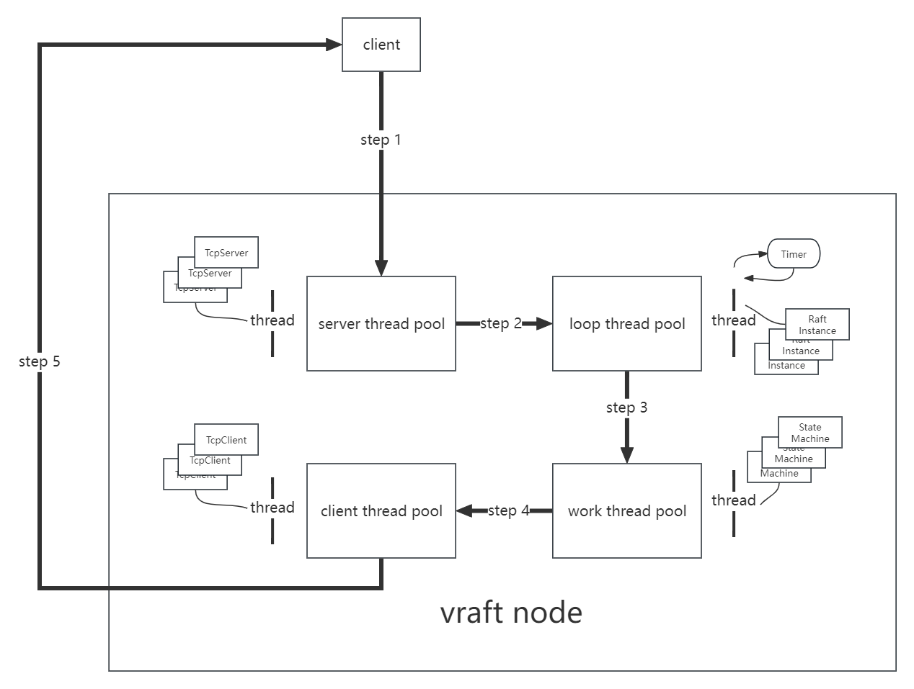
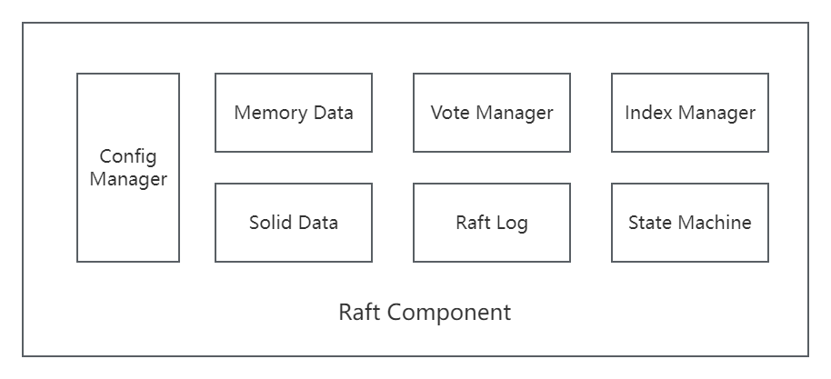
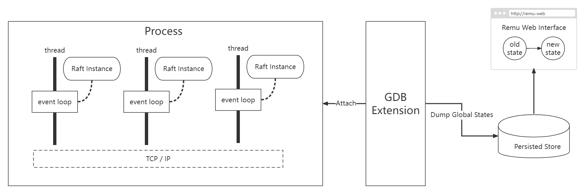
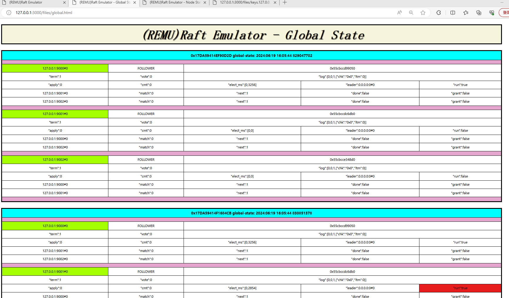
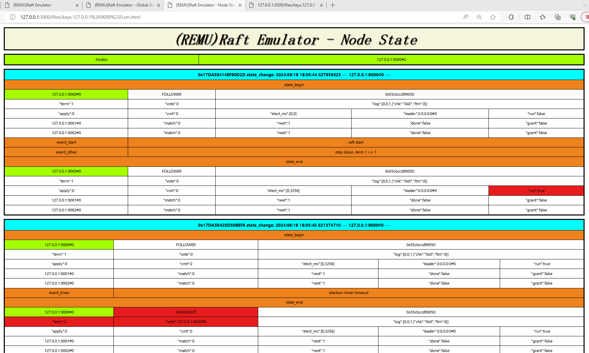
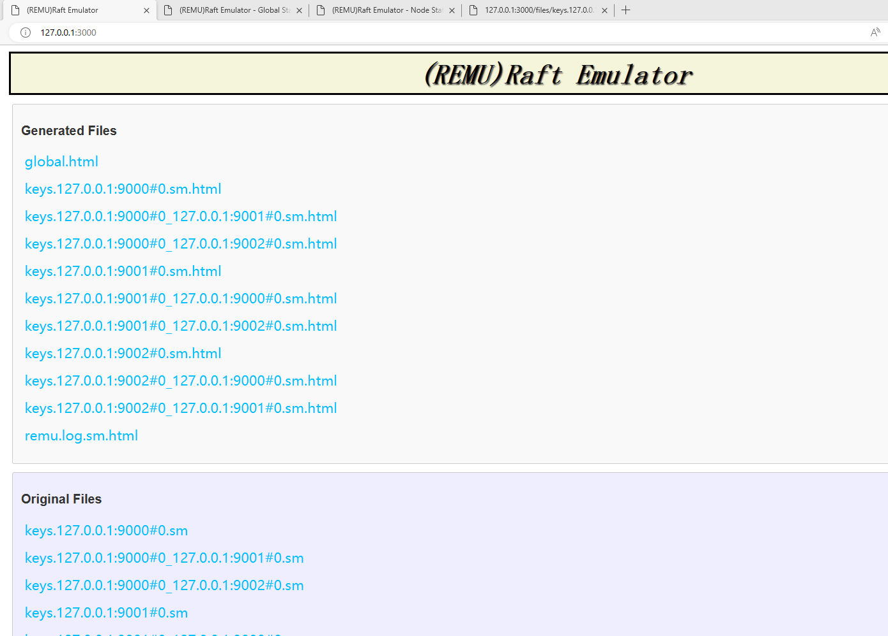
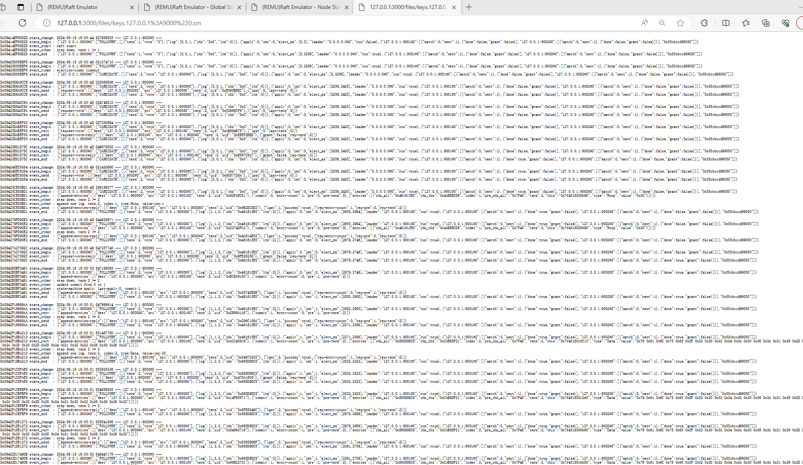
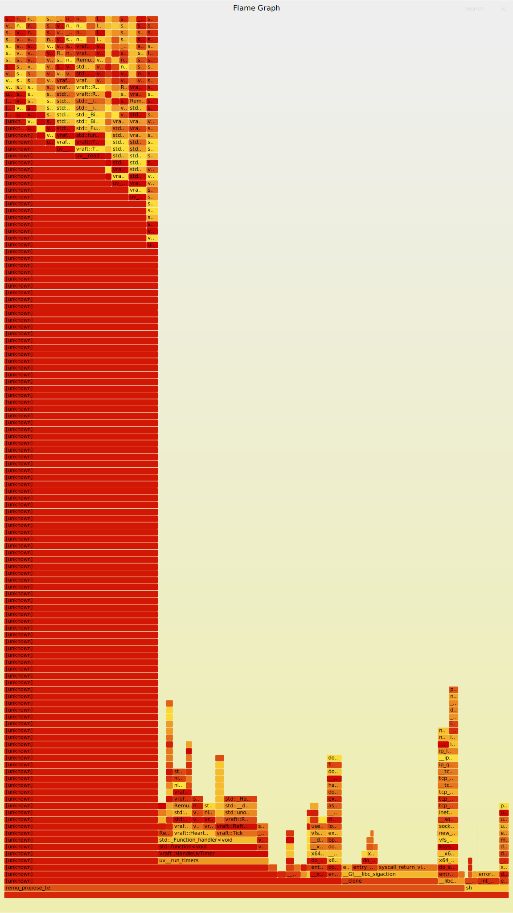

# 0 - Introduction
vraft是一个用C++编写的raft库，可以基于vraft来实现各种分布式软件，如分布式数据库等。 
vraft有如下特点：
* **Program with TLA+ Specification** -- 采用TLA+形式化验证语言进行辅助编码，从理论上保证系统的正确性
  * TLA+: https://lamport.azurewebsites.net/tla/tla.html
* **Remu(Raft Emulator)** -- 内置一个Raft模拟器，可以进行分布式调试，分布式全局状态查看，分布式自动化测试
* **Debug Everything** -- 全栈源代码可调式
* **Infrastructure Software Demo** -- 内置若干基础架构软件的实现Demo（分布式kv-store，分布式元数据管理，分布式SQL，向量数据库 ...）

# 1 - Architecture
## SEDA (Staged Event-Driven Architecture)
* VRaft实现了一种SEDA架构，用来支持Multi-Raft。
* SEDA架构的论文：
  * https://www.cs.princeton.edu/courses/archive/fall15/cos518/studpres/seda.pdf

## VRaft-SEDA-Implementation
* VRaft中有4种不同功能的线程。
  * Server Thread: 实现TcpServer，用来接收网络消息。
  * Client Thread: 实现TcpClient，用来发送网络消息。
  * Loop Thread: EventLoop，用来对各种事件（Raft消息，定时器事件等）进行响应。
  * Work Thread: 生产者消费者模型，用来顺序处理消息。
* 每种线程有对应的线程池，线程池中线程的个数根据实际情况进行配置。 

* 每个Raft Group拥有唯一的64位RaftId。Raft消息中包含这个RaftId。
* 消息在线程池之间传递，完成完整的Raft协议流程。
* 相同RaftId的消息永远被相同的线程处理。

## VRaft Inner Component

# 2 - REMU (Raft Emulator)

## Remu-Architecture

## Web Interface

#### global state

#### node state

#### index page

#### log

# 3 Flame Graph
持续优化

