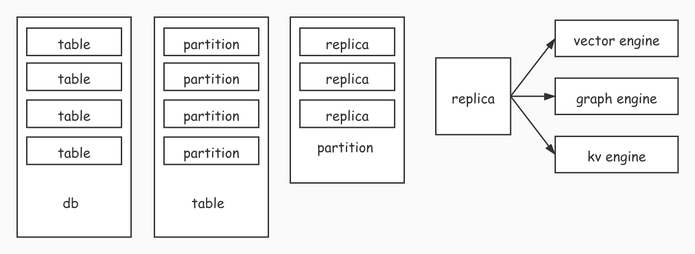
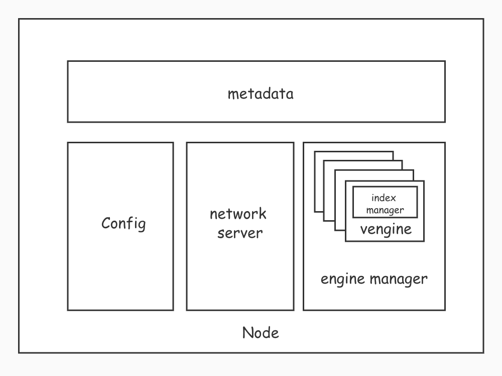

# vectordb


## What is VectorDB?

Vectordb is an open-source database used in AI service. It supports operations on KV, vector and graph, which can help the developers to build their AI service easily and quickly.
<br>
<br>
More details at [vectordb.io](http://vectordb.io)


## Features
#### 1. multiple data structure
* kv / document
* vector
* graph

#### 2. distributed storage
* a huge store
* use raft to ensure safty
* auto recovery, auto rebalance
* high throughput, low latency

## Architecture

#### 1. metadata


#### 2. stand-alone


#### 3. cluster


## Quick start

#### 1. start server
```
./vectordb-server --addr=127.0.0.1:38000 --data_path=/tmp/vectordb
```

#### 2. start client
```
./vectordb-cli --addr=127.0.0.1:38000
(vector-cli) 127.0.0.1:38000>
```

#### 3. create table
```
(vector-cli) 127.0.0.1:38000> create table {"table_name":"test_vector_table", "engine_type":"vector", "dim":10, "partition_num":10, "replica_num":3}
{
    "code": 0,
    "msg": "create table test_vector_table ok"
}
```

#### 4. generate random vectors
```
./vector-inserter 127.0.0.1:38000 test_vector_table 10 100
```

#### 5. get vector
```
(vector-cli) 127.0.0.1:38000> get {"table_name":"test_vector_table", "key":"key72_261551668"}
{
    "code": 0,
    "msg": "get vector ok",
    "vec_obj": {
        "attach_value1": "inserter_test_attach_value1",
        "attach_value2": "inserter_test_attach_value2",
        "attach_value3": "inserter_test_attach_value3",
        "key": "key72_261551668",
        "vec": [
            0.6292882057043203,
            0.5495009015079126,
            0.9620135063128609,
            0.1219228967660679,
            0.6931321652108487,
            0.8820888348306012,
            0.2154071872194331,
            0.8231134846914157,
            0.4136770024959356,
            0.4983163487623988
        ]
    }
}
```

#### 6. build index
```
(vector-cli) 127.0.0.1:38000> build index {"table_name":"test_vector_table", "index_type":"knn_graph", "k":20}
{
    "code": 0,
    "msg": "ok"
}
```

#### 7. view metadata
```
(vector-cli) 127.0.0.1:38000> show tables
{
    "tables": [
        "test_vector_table"
    ]
}
```

```
(vector-cli) 127.0.0.1:38000> desc test_vector_table
{
    "code": 0,
    "msg": "desc test_vector_table ok",
    "table": {
        "dim": 10,
        "engine_type": "vector",
        "indices": [
            {
                "index_name": "knn_graph1623826143",
                "index_type": "knn_graph"
            }
        ],
        "name": "test_vector_table",
        "partition_num": 10,
        "partitions": [
            "test_vector_table#partition_0",
            "test_vector_table#partition_1",
            "test_vector_table#partition_2",
            "test_vector_table#partition_3",
            "test_vector_table#partition_4",
            "test_vector_table#partition_5",
            "test_vector_table#partition_6",
            "test_vector_table#partition_7",
            "test_vector_table#partition_8",
            "test_vector_table#partition_9"
        ],
        "path": "/tmp/vectordb/data/test_vector_table",
        "replica_num": 3
    }
}
```
```
(vector-cli) 127.0.0.1:38000> desc test_vector_table#partition_0
{
    "code": 0,
    "msg": "desc test_vector_table#partition_0 ok",
    "partition": {
        "id": 0,
        "name": "test_vector_table#partition_0",
        "path": "/tmp/vectordb/data/test_vector_table/0",
        "replica_num": 3,
        "replicas": [
            "test_vector_table#partition_0#replica_0",
            "test_vector_table#partition_0#replica_1",
            "test_vector_table#partition_0#replica_2"
        ],
        "table_name": "test_vector_table"
    }
}
```
```
(vector-cli) 127.0.0.1:38000> desc test_vector_table#partition_0#replica_0
{
    "code": 0,
    "msg": "desc test_vector_table#partition_0#replica_0 ok",
    "replica": {
        "address": "127.0.0.1:38000",
        "id": 0,
        "name": "test_vector_table#partition_0#replica_0",
        "partition_name": "test_vector_table#partition_0",
        "path": "/tmp/vectordb/data/test_vector_table/0/0",
        "table_name": "test_vector_table"
    }
}
```

#### 8. get knn (k nearest neighbors)
```
(vector-cli) 127.0.0.1:38000> getknn {"table_name":"test_vector_table", "key":"key82_640136302", "limit":5, "index_name":"knn_graph1623826143"}
{
    "code": 0,
    "msg": "ok",
    "vecdts": [
        {
            "attach_value1": "inserter_test_attach_value1",
            "attach_value2": "inserter_test_attach_value2",
            "attach_value3": "inserter_test_attach_value3",
            "distance": 0,
            "key": "key82_640136302"
        },
        {
            "attach_value1": "inserter_test_attach_value1",
            "attach_value2": "inserter_test_attach_value2",
            "attach_value3": "inserter_test_attach_value3",
            "distance": 0.3952870669883494,
            "key": "key39_2094485213"
        },
        {
            "attach_value1": "inserter_test_attach_value1",
            "attach_value2": "inserter_test_attach_value2",
            "attach_value3": "inserter_test_attach_value3",
            "distance": 0.4180229187303537,
            "key": "key95_1693950771"
        },
        {
            "attach_value1": "inserter_test_attach_value1",
            "attach_value2": "inserter_test_attach_value2",
            "attach_value3": "inserter_test_attach_value3",
            "distance": 0.4221731709119398,
            "key": "key88_344836378"
        },
        {
            "attach_value1": "inserter_test_attach_value1",
            "attach_value2": "inserter_test_attach_value2",
            "attach_value3": "inserter_test_attach_value3",
            "distance": 0.4231269304129058,
            "key": "key62_1717661487"
        }
    ]
}
```


