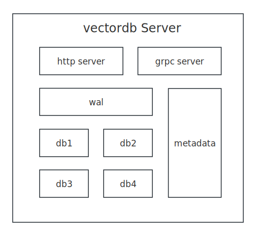
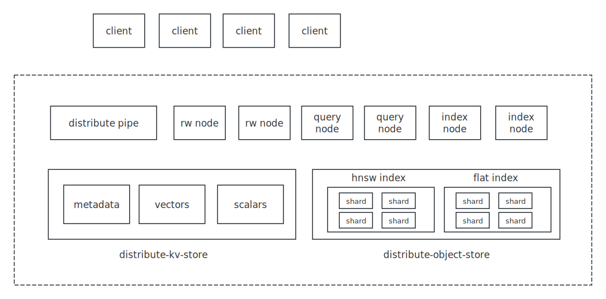

## Brief 
Over 95% of the work on the VectorDB project is completed by AI, including AI coding, AI testing, AI operation, and AI customer service.
<br>
<br>
A simple demonstration: [Searching for relevant images by text](http://115.190.11.65/album.html)
<br>
<br>
Ask About VectorDB:
[https://deepwiki.com/vectordb-io/vectordb](https://deepwiki.com/vectordb-io/vectordb)
<br>
<br>
data flow: [data flow](https://github.com/vectordb-io/vectordb/wiki/%E6%95%B0%E6%8D%AE%E6%B5%81)
<br>
<br>
vectordb-cli: [vectordb-cli](https://www.bilibili.com/video/BV1BNq1YoEf1/?vd_source=667dd64b8a907b2bb227ba72255947be)
<br>
<br>
vectordb-distribute: [vectordb-distribute](https://www.bilibili.com/video/BV1EQqmYPE7W/?vd_source=667dd64b8a907b2bb227ba72255947be)

## Testing
### coverage
[coverage](http://vectordb.io/coverage/report/index.html)

### performance
to be completed ...

## Architecture

### library


### single node


### cluster


## Build on "Ubuntu 24.04.2 LTS"

### step 1. build dependency
```
sudo apt install autoconf automake libtool -y
sudo apt-get install libgflags-dev libsnappy-dev zlib1g-dev libbz2-dev liblz4-dev libzstd-dev -y

git submodule update --init
cd third_party && sh onekey.sh && cd -
```

### step 2. build
```
# build test
make proto && make -j4

# run test
make run

# build asan test
make proto && make ASAN=yes -j4

# run asan test
make run
```

