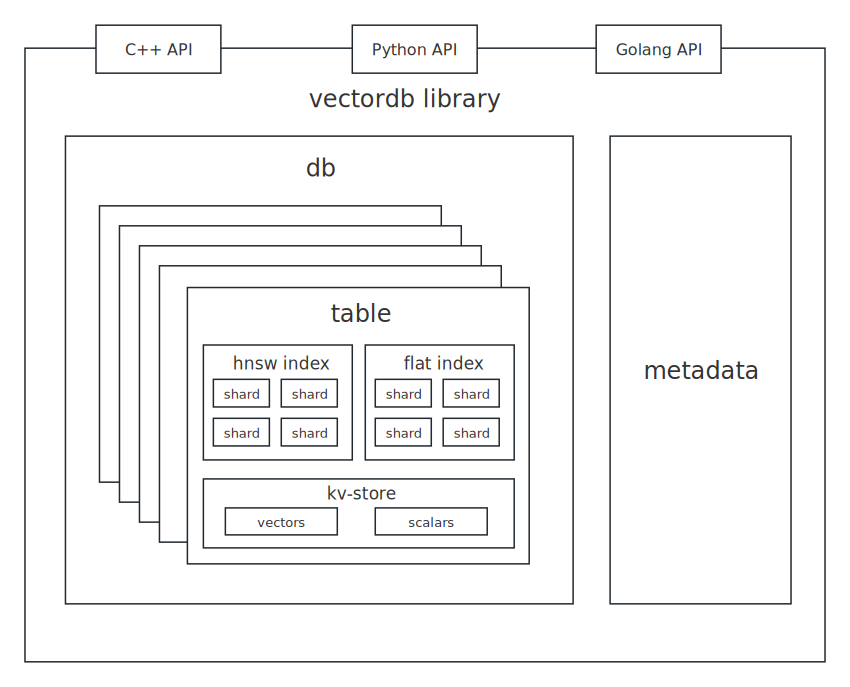
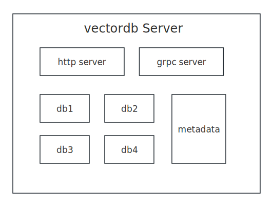
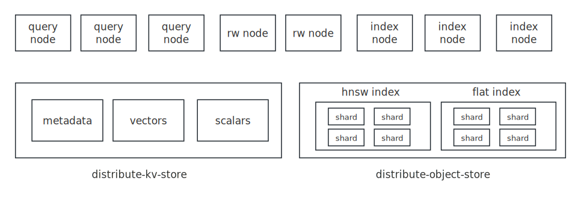

## Brief 
Over 95% of the work on the VectorDB project is completed by AI, including AI coding, AI testing, AI operation, and AI customer service.
<br>
A simple demonstration: [searching for relevant images by text](http://115.190.11.65/album.html)
<br>
Ask About VectorDB:
[https://deepwiki.com/vectordb-io/vectordb](https://deepwiki.com/vectordb-io/vectordb)

## Architecture

### library



### single node


### cluster


## Build on "Ubuntu 24.04.2 LTS"

### step 1. build dependency
```
sudo apt install autoconf automake libtool -y
sudo apt-get install libgflags-dev libsnappy-dev zlib1g-dev libbz2-dev liblz4-dev libzstd-dev -y

git submodule update --init
cd third_party && sh onekey.sh && cd -
```

### step 2. build
```
# build test
make proto && make -j4

# run test
make run

# build asan test
make proto && make ASAN=yes -j4

# run asan test
make run
```

