# vectordb

**site:** [vectordb.io](http://vectordb.io)

Vectordb is a database software used in AI service, supporting operations on **vector**, **graph**, **session**, **kv**, etc. It can work together with the LLM(Large-Language Model), especially in RAG(Retrieval-Augmented Generation) service. It is based on the project([vraft](https://github.com/vectordb-io/vraft)), which supports its distributed architecture.

## 1 Architecture

### single-server
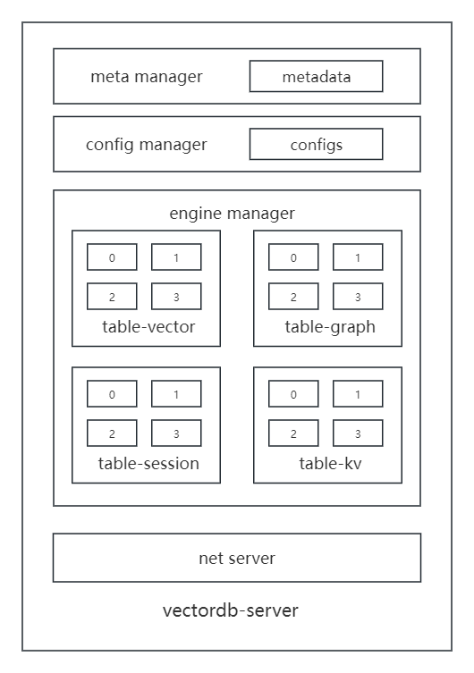

### cluster
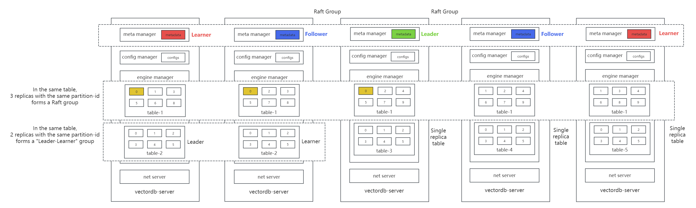

### metadata
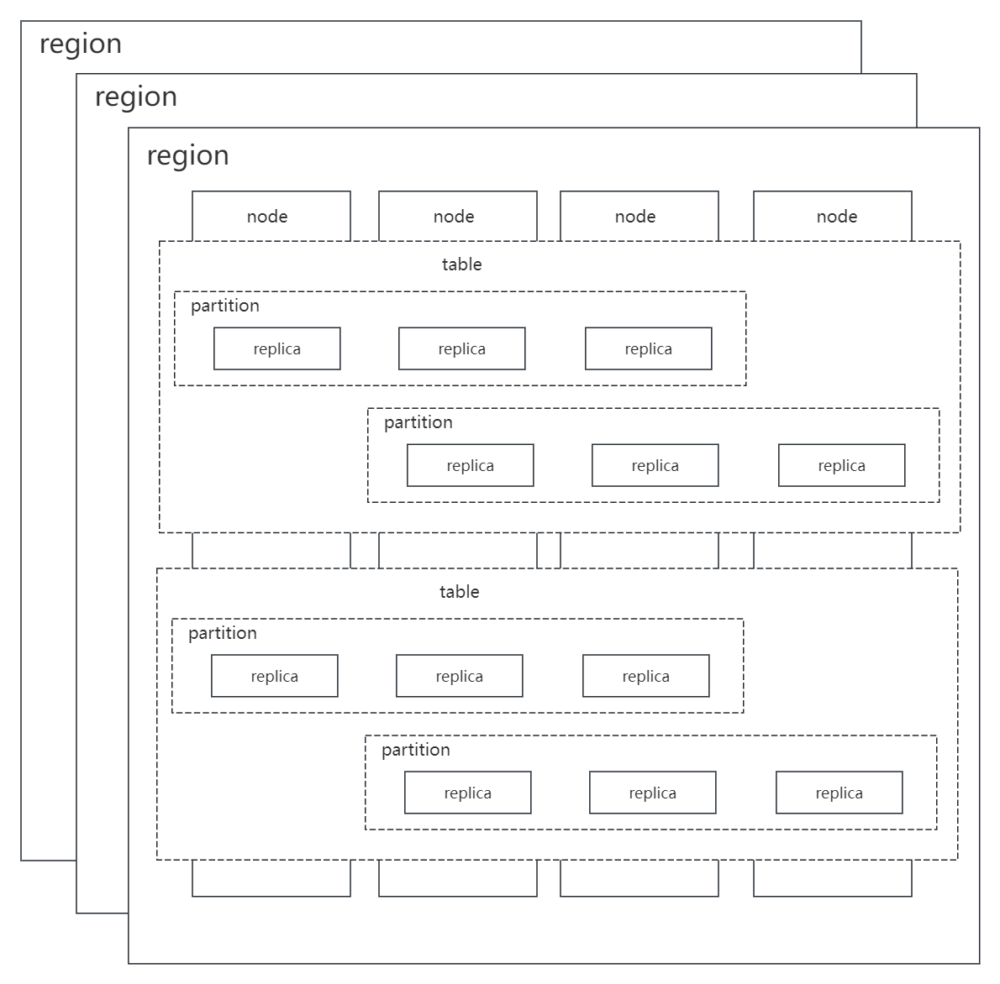

## 2 Operation

### write vectors
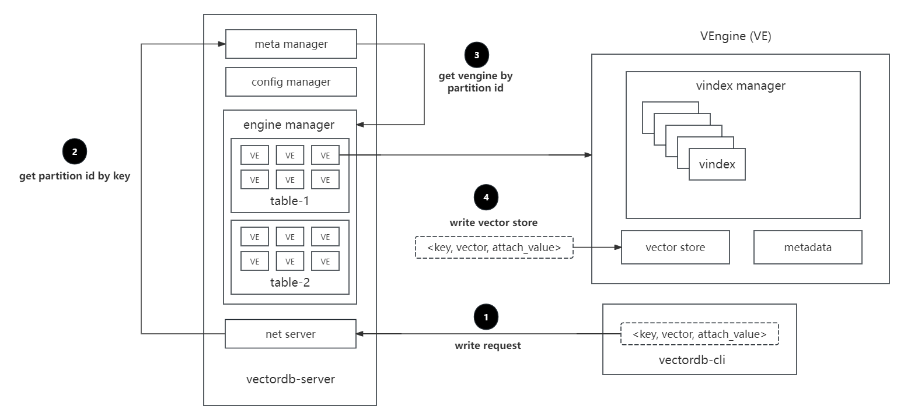

### build index
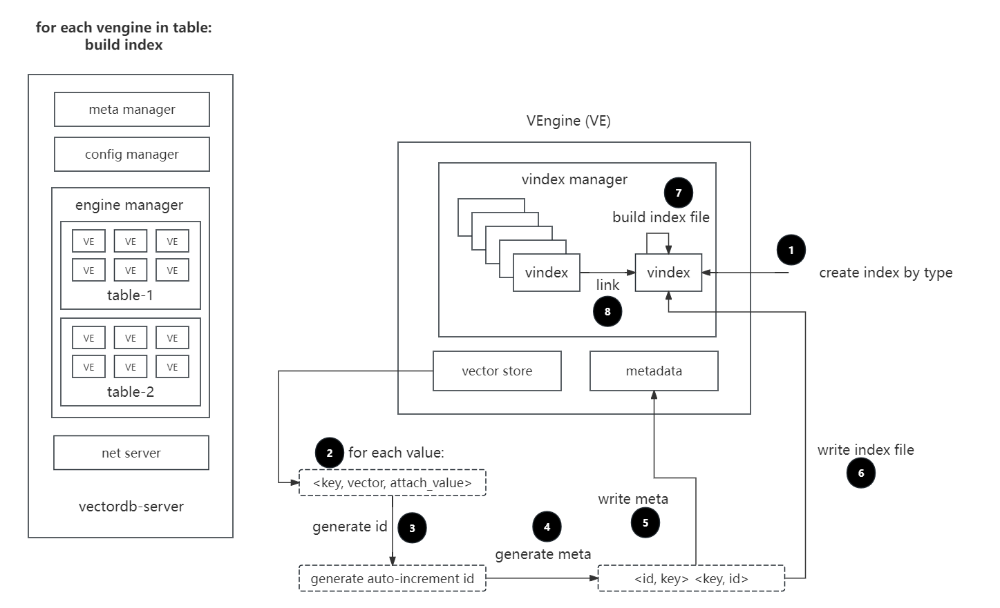

### build delta index
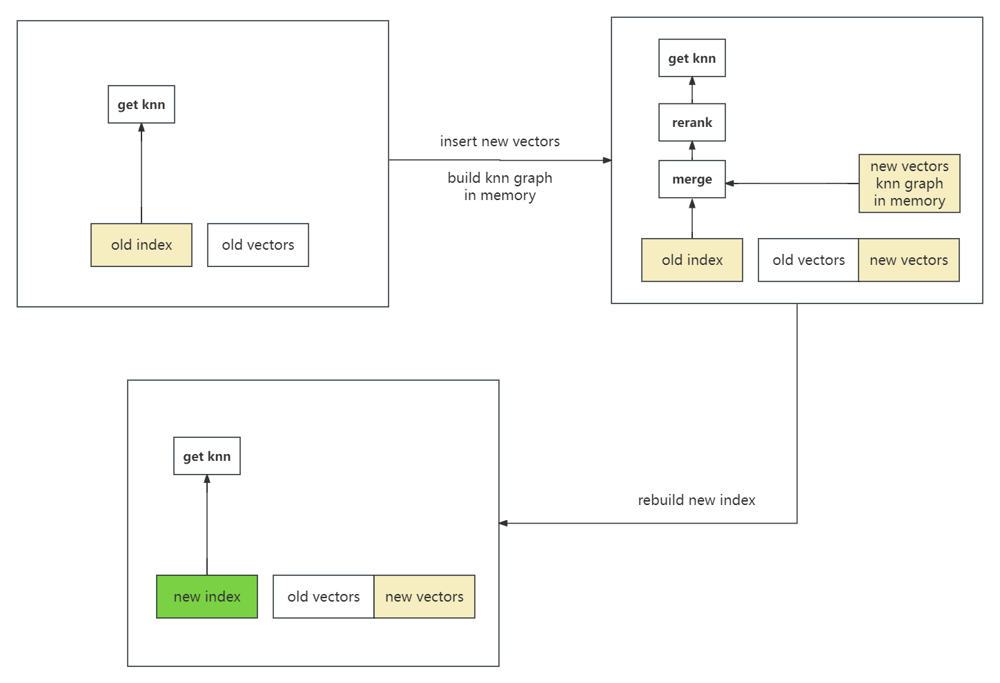

### get knn by vector


### get knn by key
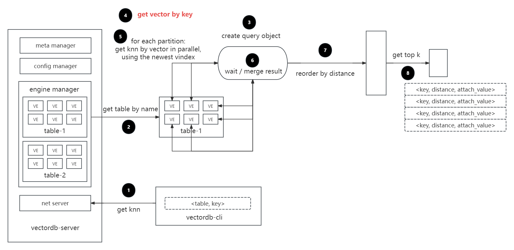

### get knn in cluster
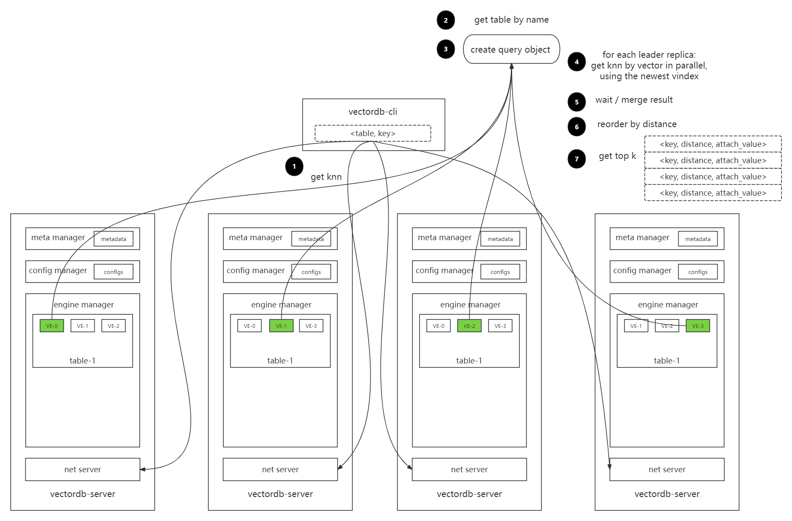

## 3 web monitor
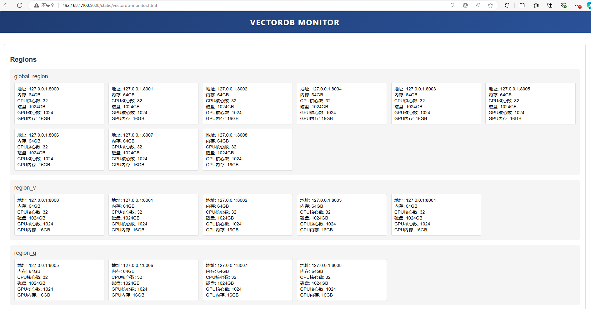

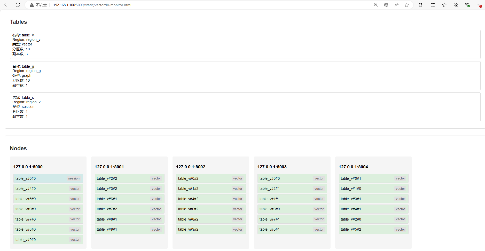

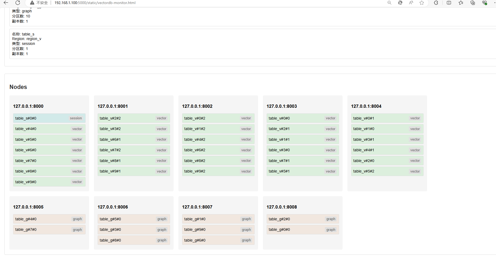

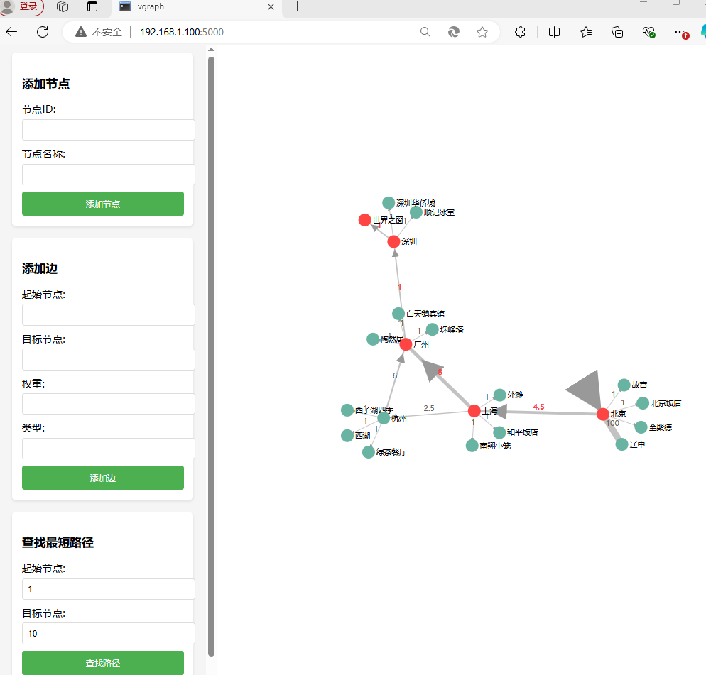

## 4 restful api
### add node request
```
POST /nodes/add
{
    "address": "127.0.0.1:8000",
    "memory": "64GB",
    "cpu-cores": 32,
    "disk": "1024GB",
    "gpu-cores": 1024,
    "gpu-memory": "16GB",
    "replicas": []
}
```

```
curl -X POST http://127.0.0.1:5000/nodes/add -H "Content-Type: application/json" -d '{"address":"127.0.0.1:8000","memory":"64GB","cpu-cores":32,"disk":"1024GB","gpu-cores":1024,"gpu-memory":"16GB","replicas":[]}'
```

### add node response
```
{
    "status": 0,
    "message": "ok"
}
```

### get one node request
```
POST /nodes/get
{
    "address": "127.0.0.1:8000"
}
```

```
curl -X POST http://127.0.0.1:5000/nodes/get -H "Content-Type: application/json" -d '{"address":"127.0.0.1:8000"}'
```

### get one node response
```
{
    "status": 0,
    "message": "ok",
    "node": {
        "address": "127.0.0.1:8000",
        "memory": "64GB",
        "cpu-cores": 32,
        "disk": "1024GB",
        "gpu-cores": 1024,
        "gpu-memory": "16GB",
        "replicas": []
    }
}
```

### get all nodes request
```
POST /nodes/get
{
}
```

```
curl -X POST http://127.0.0.1:5000/nodes/get
curl -X POST http://127.0.0.1:5000/nodes/get -H "Content-Type: application/json" -d '{}'
```

### get all nodes response
```
{
    "status": 0,
    "message": "ok",
    "nodes": [
      {
        "address": "127.0.0.1:8000",
        "memory": "64GB",
        "cpu-cores": 32,
        "disk": "1024GB",
        "gpu-cores": 1024,
        "gpu-memory": "16GB",
        "replicas": []
      },
      {
        "address": "127.0.0.1:8001",
        "memory": "64GB",
        "cpu-cores": 32,
        "disk": "1024GB",
        "gpu-cores": 1024,
        "gpu-memory": "16GB",
        "replicas": []
      },
      {
        "address": "127.0.0.1:8002",
        "memory": "64GB",
        "cpu-cores": 32,
        "disk": "1024GB",
        "gpu-cores": 1024,
        "gpu-memory": "16GB",
        "replicas": []
      }
    ]
}
```

### add region request
```
POST /regions/add
{
    "name": "region1",
    "nodes": ["127.0.0.1:8000", "127.0.0.1:8001", "127.0.0.1:8002"]
}
```

```
curl -X POST http://127.0.0.1:5000/regions/add -H "Content-Type: application/json" -d '{"name":"region1","nodes":["127.0.0.1:8000","127.0.0.1:8001","127.0.0.1:8002"]}'
```

### add region response
```
{
    "status": 0,
    "message": "ok"
}
```

### add one node to region request
```
POST /regions/add_node
{
    "region_name": "region1",
    "node_address": "127.0.0.1:8000"
}
```

```
curl -X POST http://127.0.0.1:5000/regions/add_node -H "Content-Type: application/json" -d '{"region_name":"region1","node_address":"127.0.0.1:8000"}'
```

### add one node to region response
```
{
    "status": 0,
    "message": "ok"
}
```

### delete one node from region request
```
POST /regions/delete_node
{
    "region_name": "region1",
    "node_address": "127.0.0.1:8000"
}
```

```
curl -X POST http://127.0.0.1:5000/regions/delete_node -H "Content-Type: application/json" -d '{"region_name":"region1","node_address":"127.0.0.1:8000"}'
```

### delete one node from region response
```
{
    "status": 0,
    "message": "ok"
}
``` 

### get one region request
```
POST /regions/get
{
    "name": "region1"
}
```

```
curl -X POST http://127.0.0.1:5000/regions/get -H "Content-Type: application/json" -d '{"name":"region1"}'
```

### get one region response
```
{
    "status": 0,
    "message": "ok",
    "region": {
        "name": "region1",
        "nodes": ["127.0.0.1:8000", "127.0.0.1:8001", "127.0.0.1:8002"]
    }
}
```

### get all regions request
```
POST /regions/get
{
}
```

```
curl -X POST http://127.0.0.1:5000/regions/get
curl -X POST http://127.0.0.1:5000/regions/get -H "Content-Type: application/json" -d '{}'
```

### get all regions response
```
{
    "status": 0,
    "message": "ok",
    "regions": [
      {
        "name": "global_region",
        "nodes": ["127.0.0.1:8000", "127.0.0.1:8001", "127.0.0.1:8002", "127.0.0.1:8003", "127.0.0.1:8004", "127.0.0.1:8005"]
      },
      {
        "name": "region1",
        "nodes": ["127.0.0.1:8000", "127.0.0.1:8001", "127.0.0.1:8002"]
      },
      {
        "name": "region2",
        "nodes": ["127.0.0.1:8003", "127.0.0.1:8004", "127.0.0.1:8005"]
      }
    ]
}
```

### add table request
```
POST /tables/add
{
    "name": "table1",
    "region": "region1",
    "type": "vector",
    "partition_num": 10,
    "replica_num": 3,
    "auto_add_all_replicas": true
}
```

```
curl -X POST http://127.0.0.1:5000/tables/add -H "Content-Type: application/json" -d '{"name":"table1","region":"region1","type":"vector","partition_num":10,"replica_num":3,"auto_add_all_replicas":true}'
curl -X POST http://127.0.0.1:5000/tables/add -H "Content-Type: application/json" -d '{"name":"mytable","region":"region1","type":"vector","partition_num":10,"replica_num":3,"auto_add_all_replicas":true}'
```

### add table response
```
{
    "status": 0,
    "message": "ok"
}
```

### delete table request
```
POST /tables/delete
{
    "name": "table1"
}
```

```
curl -X POST http://127.0.0.1:5000/tables/delete -H "Content-Type: application/json" -d '{"name":"table1"}'
```

### delete table response
```
{
    "status": 0,
    "message": "ok"
}
```

### get one table request
```
POST /tables/get
{
    "name": "table1"
}
```

```
curl -X POST http://127.0.0.1:5000/tables/get -H "Content-Type: application/json" -d '{"name":"table1"}'
```

### get one table response
```
{
    "status": 0,
    "message": "ok",
    "table": {
        "name": "table1",
        "region": "region1",
        "type": "vector",
        "partition_num": 10,
        "replica_num": 3
    } 
  }
```

### get all tables request
```
POST /tables/get
{
}
```

```
curl -X POST http://127.0.0.1:5000/tables/get
curl -X POST http://127.0.0.1:5000/tables/get -H "Content-Type: application/json" -d '{}'
```

### get all tables response
```
{
    "status": 0,
    "message": "ok",
    "tables": [
      {
        "name": "table1",
        "region": "region1",
        "type": "vector",
        "partition_num": 10,
        "replica_num": 3
      },
      {
        "name": "table2",
        "region": "global_region",
        "type": "graph",
        "partition_num": 10,
        "replica_num": 3
      }
    ]
}
```

### add all replicas of one table request
```
POST /tables/add_all_replicas
{
    "name": "mytable"
}
```

```
curl -X POST http://127.0.0.1:5000/tables/add_all_replicas -H "Content-Type: application/json" -d '{"name":"mytable"}'
```

### add all replicas of one table response

```
{
    "status": 0,
    "message": "ok"
}
```

### update replica_num of one table request
```
POST /tables/update_replica_num
{
    "name": "mytable",
    "new_replica_num": 3
}
```

```
curl -X POST http://127.0.0.1:5000/tables/update_replica_num -H "Content-Type: application/json" -d '{"name":"mytable","new_replica_num":3}'
```

### update replica_num of one table response
```
{
    "status": 0,
    "message": "ok"
}
```

### update partition_num of one table request
```
POST /tables/update_partition_num
{
    "name": "mytable",
    "new_partition_num": 3
}
```

```
curl -X POST http://127.0.0.1:5000/tables/update_partition_num -H "Content-Type: application/json" -d '{"name":"mytable","new_partition_num":20}'
```

### update partition_num of one table response
```
{
    "status": 0,
    "message": "ok"
}
```

### update region of one table request
```
POST /tables/update_region
{
    "name": "mytable",
    "new_region": "region2"
}
```

```
curl -X POST http://127.0.0.1:5000/tables/update_region -H "Content-Type: application/json" -d '{"name":"mytable","new_region":"region2"}'
``` 

### update region of one table response
```
{
    "status": 0,
    "message": "ok"
}
```

### add partition request
```
POST /partitions/add
{
    "table_name": "mytable",
    "partition_id": 3
}
```

```
curl -X POST http://127.0.0.1:5000/partitions/add -H "Content-Type: application/json" -d '{"table_name":"mytable","partition_id":3}'
```

### add partition response
```
{
    "status": 0,
    "message": "ok"
}
```

### get one partition request
```
POST /partitions/get
{
    "partition_name": "mytable#3"
}
```

```
curl -X POST http://127.0.0.1:5000/partitions/get -H "Content-Type: application/json" -d '{"partition_name":"mytable#3"}'
```

### get one partition response
```
{
    "status": 0,
    "message": "ok",
    "partition": {
        "partition_name": "mytable#3",
        "partition_id": 3,
        "table_name": "mytable",
        "table_info": {
            "name": "mytable",
            "region": "region1",
            "type": "vector",
            "partition_num": 10,
            "replica_num": 3
        }
    }
}
```

### get all partitions of one table request
```
POST /partitions/get
{
    "table_name": "mytable"
}
```

```
curl -X POST http://127.0.0.1:5000/partitions/get -H "Content-Type: application/json" -d '{"table_name":"mytable"}'
```

### get all partitions of one table response
```
{
    "status": 0,
    "message": "ok",
    "partitions": [
      {
        "partition_name": "mytable#0",
        "partition_id": 0,
        "table_name": "mytable",
        "table_info": {
            "name": "mytable",
            "region": "region1",
            "type": "vector",
            "partition_num": 10,
            "replica_num": 3
        }
      },
      {
        "partition_name": "mytable#1",
        "partition_id": 1,
        "table_name": "mytable",
        "table_info": {
            "name": "mytable",
            "region": "region1",
            "type": "vector",
            "partition_num": 10,
            "replica_num": 3
        }
      },
      {
        "partition_name": "mytable#2",
        "partition_id": 2,
        "table_name": "mytable",
        "table_info": {
            "name": "mytable",
            "region": "region1",
            "type": "vector",
            "partition_num": 10,
            "replica_num": 3
        }
      },
      {
        "partition_name": "mytable#3",
        "partition_id": 3,
        "table_name": "mytable",
        "table_info": {
            "name": "mytable",
            "region": "region1",
            "type": "vector",
            "partition_num": 10,
            "replica_num": 3
        }
      },
      {
        "partition_name": "mytable#4",
        "partition_id": 4,
        "table_name": "mytable",
        "table_info": {
            "name": "mytable",
            "region": "region1",
            "type": "vector",
            "partition_num": 10,
            "replica_num": 3
        }
      },
      {
        "partition_name": "mytable#5",
        "partition_id": 5,
        "table_name": "mytable",
        "table_info": {
            "name": "mytable",
            "region": "region1",
            "type": "vector",
            "partition_num": 10,
            "replica_num": 3
        }
      },
      {
        "partition_name": "mytable#6",
        "partition_id": 6,
        "table_name": "mytable",
        "table_info": {
            "name": "mytable",
            "region": "region1",
            "type": "vector",
            "partition_num": 10,
            "replica_num": 3
        }
      },
      {
        "partition_name": "mytable#7",
        "partition_id": 7,
        "table_name": "mytable",
        "table_info": {
            "name": "mytable",
            "region": "region1",
            "type": "vector",
            "partition_num": 10,
            "replica_num": 3
        }
      },
      {
        "partition_name": "mytable#8",
        "partition_id": 8,
        "table_name": "mytable",
        "table_info": {
            "name": "mytable",
            "region": "region1",
            "type": "vector",
            "partition_num": 10,
            "replica_num": 3
        }
      },
      {
        "partition_name": "mytable#9",
        "partition_id": 9,
        "table_name": "mytable",
        "table_info": {
            "name": "mytable",
            "region": "region1",
            "type": "vector",
            "partition_num": 10,
            "replica_num": 3
        }
      }
    ]
}
```

### add replica request
```
POST /replicas/add
{
    "table_name": "mytable",
    "partition_id": 3,
    "replica_id": 1,
    "node_address": "127.0.0.1:8000"
}
```

```
curl -X POST http://127.0.0.1:5000/replicas/add -H "Content-Type: application/json" -d '{"table_name":"mytable","partition_id":3,"replica_id":1,"node_address":"127.0.0.1:8000"}'
```

### add replica response
```
{
    "status": 0,
    "message": "ok"
}
```

### move replica request
```
POST /replicas/move
{
    "replica_name": "mytable#3#1",
    "dest_node_address": "127.0.0.1:8000"
}
```

```
curl -X POST http://127.0.0.1:5000/replicas/move -H "Content-Type: application/json" -d '{"replica_name":"mytable#3#1","dest_node_address":"127.0.0.1:8000"}'
```

### move replica response
```
{
    "status": 0,
    "message": "ok"
}
```

### delete replica request
```
POST /replicas/delete
{
    "replica_name": "mytable#3#1"
}
```

```
curl -X POST http://127.0.0.1:5000/replicas/delete -H "Content-Type: application/json" -d '{"replica_name":"mytable#3#1"}'
```

### delete replica response
```
{
    "status": 0,
    "message": "ok"
}
```

### get one replica request
```
POST /replicas/get
{
    "replica_name": "mytable#3#1"
}
```

```
curl -X POST http://127.0.0.1:5000/replicas/get -H "Content-Type: application/json" -d '{"replica_name":"mytable#3#1"}'
```

### get one replica response
```
{
    "status": 0,
    "message": "ok",
    "replica": {
        "replica_name": "mytable#3#1",
        "replica_id": 1,
        "partition_id": 3,
        "table_name": "mytable",
        "table_info": {
            "name": "mytable",
            "region": "region1",
            "type": "vector",
            "partition_num": 10,
            "replica_num": 3
        }
      }
}
```

### get all replicas of one table request
```
POST /replicas/get
{
    "table_name": "mytable"
}
```

```
curl -X POST http://127.0.0.1:5000/replicas/get -H "Content-Type: application/json" -d '{"table_name":"mytable"}'
```


### get all replicas of one table response
```
{
    "status": 0,
    "message": "ok",
    "replicas": [
      {
        "replica_name": "mytable#0#0",
        "replica_id": 0,
        "partition_id": 0,
        "table_name": "mytable",
        "table_info": {
            "name": "mytable",
            "region": "region1",
            "type": "vector",
            "partition_num": 10,
            "replica_num": 3
        }
      },
      {
        "replica_name": "mytable#0#1",
        "replica_id": 1,
        "partition_id": 0,
        "table_name": "mytable",
        "table_info": {
            "name": "mytable",
            "region": "region1",
            "type": "vector",
            "partition_num": 10,
            "replica_num": 3
        }
      },
      {
        "replica_name": "mytable#0#2",
        "replica_id": 2,
        "partition_id": 0,
        "table_name": "mytable",
        "table_info": {
            "name": "mytable",
            "region": "region1",
            "type": "vector",
            "partition_num": 10,
            "replica_num": 3
        }
      },
      {
        "replica_name": "mytable#1#0",
        "replica_id": 0,
        "partition_id": 1,
        "table_name": "mytable",
        "table_info": {
            "name": "mytable",
            "region": "region1",
            "type": "vector",
            "partition_num": 10,
            "replica_num": 3
        }
      },
      {
        "replica_name": "mytable#1#1",
        "replica_id": 1,
        "partition_id": 1,
        "table_name": "mytable",
        "table_info": {
            "name": "mytable",
            "region": "region1",
            "type": "vector",
            "partition_num": 10,
            "replica_num": 3
        }
      },
      {
        "replica_name": "mytable#1#2",
        "replica_id": 2,
        "partition_id": 1,
        "table_name": "mytable",
        "table_info": {
            "name": "mytable",
            "region": "region1",
            "type": "vector",
            "partition_num": 10,
            "replica_num": 3
        }
      },
      {
        "replica_name": "mytable#2#0",
        "replica_id": 0,
        "partition_id": 2,
        "table_name": "mytable",
        "table_info": {
            "name": "mytable",
            "region": "region1",
            "type": "vector",
            "partition_num": 10,
            "replica_num": 3
        }
      },
      {
        "replica_name": "mytable#2#1",
        "replica_id": 1,
        "partition_id": 2,
        "table_name": "mytable",
        "table_info": {
            "name": "mytable",
            "region": "region1",
            "type": "vector",
            "partition_num": 10,
            "replica_num": 3
        }
      },
      {
        "replica_name": "mytable#2#2",
        "replica_id": 2,
        "partition_id": 2,
        "table_name": "mytable",
        "table_info": {
            "name": "mytable",
            "region": "region1",
            "type": "vector",
            "partition_num": 10,
            "replica_num": 3
        }
      },
      {
        "replica_name": "mytable#3#0",
        "replica_id": 0,
        "partition_id": 3,
        "table_name": "mytable",
        "table_info": {
            "name": "mytable",
            "region": "region1",
            "type": "vector",
            "partition_num": 10,
            "replica_num": 3
        }
      },
      {
        "replica_name": "mytable#3#1",
        "replica_id": 1,
        "partition_id": 3,
        "table_name": "mytable",
        "table_info": {
            "name": "mytable",
            "region": "region1",
            "type": "vector",
            "partition_num": 10,
            "replica_num": 3
        }
      },
      {
        "replica_name": "mytable#3#2",
        "replica_id": 2,
        "partition_id": 3,
        "table_name": "mytable",
        "table_info": {
            "name": "mytable",
            "region": "region1",
            "type": "vector",
            "partition_num": 10,
            "replica_num": 3
        }
      },
      {
        "replica_name": "mytable#4#0",
        "replica_id": 0,
        "partition_id": 4,
        "table_name": "mytable",
        "table_info": {
            "name": "mytable",
            "region": "region1",
            "type": "vector",
            "partition_num": 10,
            "replica_num": 3
        }
      },
      {
        "replica_name": "mytable#4#1",
        "replica_id": 1,
        "partition_id": 4,
        "table_name": "mytable",
        "table_info": {
            "name": "mytable",
            "region": "region1",
            "type": "vector",
            "partition_num": 10,
            "replica_num": 3
        }
      },
      {
        "replica_name": "mytable#4#2",
        "replica_id": 2,
        "partition_id": 4,
        "table_name": "mytable",
        "table_info": {
            "name": "mytable",
            "region": "region1",
            "type": "vector",
            "partition_num": 10,
            "replica_num": 3
        }
      },
      {
        "replica_name": "mytable#5#0",
        "replica_id": 0,
        "partition_id": 5,
        "table_name": "mytable",
        "table_info": {
            "name": "mytable",
            "region": "region1",
            "type": "vector",
            "partition_num": 10,
            "replica_num": 3
        }
      },
      {
        "replica_name": "mytable#5#1",
        "replica_id": 1,
        "partition_id": 5,
        "table_name": "mytable",
        "table_info": {
            "name": "mytable",
            "region": "region1",
            "type": "vector",
            "partition_num": 10,
            "replica_num": 3
        }
      },
      {
        "replica_name": "mytable#5#2",
        "replica_id": 2,
        "partition_id": 5,
        "table_name": "mytable",
        "table_info": {
            "name": "mytable",
            "region": "region1",
            "type": "vector",
            "partition_num": 10,
            "replica_num": 3
        }
      },
      {
        "replica_name": "mytable#6#0",
        "replica_id": 0,
        "partition_id": 6,
        "table_name": "mytable",
        "table_info": {
            "name": "mytable",
            "region": "region1",
            "type": "vector",
            "partition_num": 10,
            "replica_num": 3
        }
      },
      {
        "replica_name": "mytable#6#1",
        "replica_id": 1,
        "partition_id": 6,
        "table_name": "mytable",
        "table_info": {
            "name": "mytable",
            "region": "region1",
            "type": "vector",
            "partition_num": 10,
            "replica_num": 3
        }
      },
      {
        "replica_name": "mytable#6#2",
        "replica_id": 2,
        "partition_id": 6,
        "table_name": "mytable",
        "table_info": {
            "name": "mytable",
            "region": "region1",
            "type": "vector",
            "partition_num": 10,
            "replica_num": 3
        }
      },
      {
        "replica_name": "mytable#7#0",
        "replica_id": 0,
        "partition_id": 7,
        "table_name": "mytable",
        "table_info": {
            "name": "mytable",
            "region": "region1",
            "type": "vector",
            "partition_num": 10,
            "replica_num": 3
        }
      },
      {
        "replica_name": "mytable#7#1",
        "replica_id": 1,
        "partition_id": 7,
        "table_name": "mytable",
        "table_info": {
            "name": "mytable",
            "region": "region1",
            "type": "vector",
            "partition_num": 10,
            "replica_num": 3
        }
      },
      {
        "replica_name": "mytable#7#2",
        "replica_id": 2,
        "partition_id": 7,
        "table_name": "mytable",
        "table_info": {
            "name": "mytable",
            "region": "region1",
            "type": "vector",
            "partition_num": 10,
            "replica_num": 3
        }
      },
      {
        "replica_name": "mytable#8#0",
        "replica_id": 0,
        "partition_id": 8,
        "table_name": "mytable",
        "table_info": {
            "name": "mytable",
            "region": "region1",
            "type": "vector",
            "partition_num": 10,
            "replica_num": 3
        }
      },
      {
        "replica_name": "mytable#8#1",
        "replica_id": 1,
        "partition_id": 8,
        "table_name": "mytable",
        "table_info": {
            "name": "mytable",
            "region": "region1",
            "type": "vector",
            "partition_num": 10,
            "replica_num": 3
        }
      },
      {
        "replica_name": "mytable#8#2",
        "replica_id": 2,
        "partition_id": 8,
        "table_name": "mytable",
        "table_info": {
            "name": "mytable",
            "region": "region1",
            "type": "vector",
            "partition_num": 10,
            "replica_num": 3
        }
      },
      {
        "replica_name": "mytable#9#0",
        "replica_id": 0,
        "partition_id": 9,
        "table_name": "mytable",
        "table_info": {
            "name": "mytable",
            "region": "region1",
            "type": "vector",
            "partition_num": 10,
            "replica_num": 3
        }
      },
      {
        "replica_name": "mytable#9#1",
        "replica_id": 1,
        "partition_id": 9,
        "table_name": "mytable",
        "table_info": {
            "name": "mytable",
            "region": "region1",
            "type": "vector",
            "partition_num": 10,
            "replica_num": 3
        }
      },
      {
        "replica_name": "mytable#9#2",
        "replica_id": 2,
        "partition_id": 9,
        "table_name": "mytable",
        "table_info": {
            "name": "mytable",
            "region": "region1",
            "type": "vector",
            "partition_num": 10,
            "replica_num": 3
        }
      }
    ]
}
```

### reblance table request
```
POST /tables/reblance
{
    "table_name": "mytable"
}
```

```
curl -X POST http://127.0.0.1:5000/tables/reblance -H "Content-Type: application/json" -d '{"table_name":"mytable"}'
```

### reblance table response
```
{
    "status": 0,
    "message": "ok"
}
```


## 5 vectordb-cli commands:

#### create table
```
(vectordb-cli)> create table --name=test-table --partition_num=10 --replica_num=3 --dim=10
ok
```

#### show tables
```
(vectordb-cli)> show tables;
[
  {
    "size": 1
  },
  [
    "test-table"
  ]
]
```

#### desc table test-table
```
(vectordb-cli)> desc table test-table;
{
  "table": {
    "dim": 10,
    "name": "test-table",
    "partition_names": [
      "test-table#0",
      "test-table#1",
      "test-table#2",
      "test-table#3",
      "test-table#4",
      "test-table#5",
      "test-table#6",
      "test-table#7",
      "test-table#8",
      "test-table#9"
    ],
    "partition_num": 10,
    "path": "/tmp/local_console/data/test-table",
    "replica_num": 3,
    "uid": 0
  }
}
```

#### show partitions
```
(vectordb-cli)> show partitions;
[
  {
    "size": 10
  },
  [
    "test-table#0",
    "test-table#1",
    "test-table#2",
    "test-table#3",
    "test-table#4",
    "test-table#5",
    "test-table#6",
    "test-table#7",
    "test-table#8",
    "test-table#9"
  ]
]
```

#### desc partition
```
(vectordb-cli)> desc partition test-table#0;
{
  "partition": {
    "dim": 10,
    "id": 0,
    "name": "test-table#0",
    "path": "/tmp/local_console/data/test-table/test-table#0",
    "replica_ids": [
      0,
      1,
      2
    ],
    "replica_names": [
      "test-table#0#0",
      "test-table#0#1",
      "test-table#0#2"
    ],
    "replica_num": 3,
    "table_name": "test-table",
    "table_uid": 0,
    "uid": 0
  }
}
```

#### show replicas
```
(vectordb-cli)> show replicas;
[
  {
    "size": 30
  },
  [
    "test-table#0#0",
    "test-table#0#1",
    "test-table#0#2",
    "test-table#1#0",
    "test-table#1#1",
    "test-table#1#2",
    "test-table#2#0",
    "test-table#2#1",
    "test-table#2#2",
    "test-table#3#0",
    "test-table#3#1",
    "test-table#3#2",
    "test-table#4#0",
    "test-table#4#1",
    "test-table#4#2",
    "test-table#5#0",
    "test-table#5#1",
    "test-table#5#2",
    "test-table#6#0",
    "test-table#6#1",
    "test-table#6#2",
    "test-table#7#0",
    "test-table#7#1",
    "test-table#7#2",
    "test-table#8#0",
    "test-table#8#1",
    "test-table#8#2",
    "test-table#9#0",
    "test-table#9#1",
    "test-table#9#2"
  ]
]
```

#### desc replica
```
(vectordb-cli)> desc replica test-table#0#0;
{
  "replica": {
    "dim": 10,
    "id": 0,
    "name": "test-table#0#0",
    "partition_name": "test-table#0",
    "partition_uid": 1,
    "path": "/tmp/local_console/data/test-table/test-table#0/test-table#0#0",
    "table_name": "test-table",
    "table_uid": 0,
    "uid": 0
  }
}
```

#### load data
```
(vectordb-cli)> load --table=test-table --file=/tmp/vec.txt
load line 1: key_0; 0.164831, 0.445726, 0.097244, 0.084204, 0.938371, 0.993784, 0.154138, 0.355323, 0.712672, 0.106347; attach_value_0
load line 2: key_1; 0.644472, 0.876031, 0.787079, 0.434390, 0.711722, 0.874121, 0.902163, 0.195676, 0.613694, 0.603673; attach_value_1
load line 3: key_2; 0.616118, 0.992739, 0.923674, 0.620808, 0.059192, 0.901620, 0.298015, 0.445837, 0.292800, 0.094566; attach_value_2
load line 4: key_3; 0.776293, 0.187398, 0.862613, 0.587328, 0.585514, 0.009252, 0.565339, 0.847481, 0.628480, 0.766569; attach_value_3
loading ...
load line 998: key_997; 0.206405, 0.623443, 0.877383, 0.178855, 0.404137, 0.395500, 0.128035, 0.048595, 0.566553, 0.578899; attach_value_997
load line 999: key_998; 0.298418, 0.379632, 0.866918, 0.528748, 0.472486, 0.168596, 0.927100, 0.348894, 0.966354, 0.132273; attach_value_998
load line 1000: key_999; 0.518561, 0.439811, 0.279292, 0.922664, 0.023825, 0.566798, 0.716824, 0.992219, 0.369687, 0.625317; attach_value_999
ok
```

#### build index
```
(vectordb-cli)> build index --table=test-table --annoy_tree_num=10
ok
```

#### desc engine
```
(vectordb-cli)> desc engine test-table#0#0;
{
  "vengine": {
    "indices": [
      {
        "index": {
          "annoy_path_file": "/tmp/local_console/data/test-table/test-table#0/test-table#0#0/index/IndexAnnoy_1719590965654646882/annoy.tree",
          "keyid_path": "/tmp/local_console/data/test-table/test-table#0/test-table#0#0/index/IndexAnnoy_1719590965654646882/keyid",
          "meta": {
            "param": {
              "annoy_tree_num": 10,
              "dim": 10,
              "distance_type": [
                0,
                "Cosine"
              ],
              "index_type": [
                0,
                "IndexAnnoy"
              ],
              "path": "/tmp/local_console/data/test-table/test-table#0/test-table#0#0/index/IndexAnnoy_1719590965654646882",
              "timestamp": [
                1719590965654646882,
                "2024:06:29 00:09:25 654646882"
              ]
            }
          },
          "meta_path_": "/tmp/local_console/data/test-table/test-table#0/test-table#0#0/index/IndexAnnoy_1719590965654646882/meta"
        },
        "time": "2024:06:29 00:09:25 654646882"
      }
    ],
    "meta": {
      "dim": 10
    }
  }
}
```

#### getknn by key
```
(vectordb-cli)> getknn --table=test-table --key=key_0 --limit=20
{distance:0.000000, key:key_0, attach_value:attach_value_0}
{distance:0.416249, key:key_493, attach_value:attach_value_493}
{distance:0.469023, key:key_830, attach_value:attach_value_830}
{distance:0.551433, key:key_101, attach_value:attach_value_101}
{distance:0.574484, key:key_135, attach_value:attach_value_135}
{distance:0.586908, key:key_521, attach_value:attach_value_521}
{distance:0.589036, key:key_340, attach_value:attach_value_340}
{distance:0.601359, key:key_554, attach_value:attach_value_554}
{distance:0.623582, key:key_328, attach_value:attach_value_328}
{distance:0.626737, key:key_954, attach_value:attach_value_954}
{distance:0.637985, key:key_975, attach_value:attach_value_975}
{distance:0.649394, key:key_485, attach_value:attach_value_485}
{distance:0.666963, key:key_1, attach_value:attach_value_1}
{distance:0.672188, key:key_487, attach_value:attach_value_487}
{distance:0.690556, key:key_955, attach_value:attach_value_955}
{distance:0.691762, key:key_846, attach_value:attach_value_846}
{distance:0.697253, key:key_72, attach_value:attach_value_72}
{distance:0.699238, key:key_805, attach_value:attach_value_805}
{distance:0.706862, key:key_177, attach_value:attach_value_177}
{distance:0.707307, key:key_900, attach_value:attach_value_900}
```

#### getknn by vector
```
(vectordb-cli)> getknn --table=test-table --vec=0.435852,0.031869,0.161108,0.055670,0.846847,0.604385,0.075282,0.386435,0.407000,0.101307 --limit=20
{distance:0.375453, key:key_753, attach_value:attach_value_753}
{distance:0.379140, key:key_468, attach_value:attach_value_468}
{distance:0.410338, key:key_0, attach_value:attach_value_0}
{distance:0.422657, key:key_589, attach_value:attach_value_589}
{distance:0.431398, key:key_267, attach_value:attach_value_267}
{distance:0.442684, key:key_312, attach_value:attach_value_312}
{distance:0.449014, key:key_278, attach_value:attach_value_278}
{distance:0.454012, key:key_885, attach_value:attach_value_885}
{distance:0.455855, key:key_766, attach_value:attach_value_766}
{distance:0.467043, key:key_824, attach_value:attach_value_824}
{distance:0.469801, key:key_77, attach_value:attach_value_77}
{distance:0.472218, key:key_507, attach_value:attach_value_507}
{distance:0.473036, key:key_521, attach_value:attach_value_521}
{distance:0.473579, key:key_84, attach_value:attach_value_84}
{distance:0.479299, key:key_20, attach_value:attach_value_20}
{distance:0.483883, key:key_117, attach_value:attach_value_117}
{distance:0.488278, key:key_799, attach_value:attach_value_799}
{distance:0.489877, key:key_738, attach_value:attach_value_738}
{distance:0.495219, key:key_787, attach_value:attach_value_787}
{distance:0.499322, key:key_15, attach_value:attach_value_15}
```

#### put vector
```
(vectordb-cli)> put --table=test-table --key=kkk --vec=0.435852,0.031869,0.161108,0.055670,0.846847,0.604385,0.075282,0.386435,0.407000,0.101307 --attach_value=aaavvv
ok
```

#### get vector
```
(vectordb-cli)> get --table=test-table --key=kkk  
{
  "vec-obj": {
    "key": "kkk",
    "value": {
      "attach_value": "aaavvv",
      "vec": [
        0.4358519911766052,
        0.03186900168657303,
        0.16110800206661224,
        0.05567000061273575,
        0.8468469977378845,
        0.6043850183486938,
        0.07528200000524521,
        0.38643500208854675,
        0.40700000524520874,
        0.10130699723958969
      ]
    }
  }
}
```

#### delete vector
```
(vectordb-cli)> del --table=test-table --key=kkk  
ok
```

#### help
```
(vectordb-cli)> help
example:

help
version
quit
meta
put --table=test-table --key=key_0 --vec=0.435852,0.031869,0.161108,0.055670,0.846847,0.604385,0.075282,0.386435,0.407000,0.101307 --attach_value=aaavvv
get --table=test-table --key=key_0
del --table=test-table --key=key_0
getknn --table=test-table --key=key_0 --limit=20
getknn --table=test-table --vec=0.435852,0.031869,0.161108,0.055670,0.846847,0.604385,0.075282,0.386435,0.407000,0.101307 --limit=20
load --table=test-table --file=/tmp/vec.txt
create table --name=test-table --partition_num=10 --replica_num=3 --dim=10
build index --table=test-table --annoy_tree_num=10
desc table test-table
desc partition test-table#0
desc replica test-table#0#0
desc engine test-table#0#0
show tables
show partitions
show replicas
```

